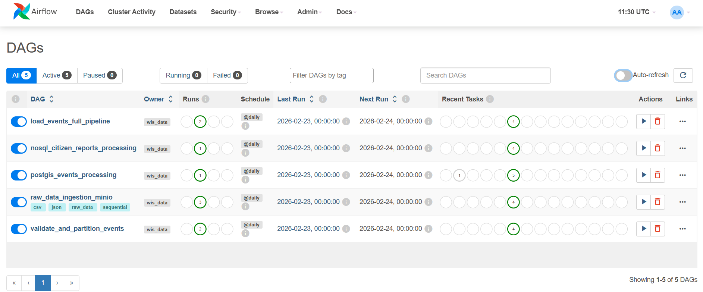
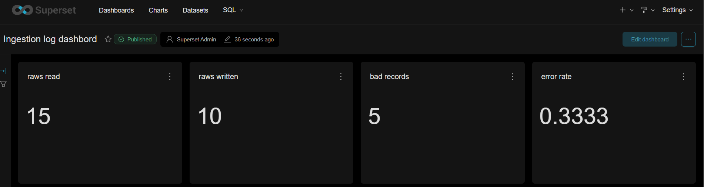

# Data Lab POC

A modern data platform built for ingesting, processing, and visualizing event data using a robust open-source stack (Postgres, Airflow, MinIO, Superset).


The platform follows a **Medallion Architecture** (Raw -> Silver/Clean -> Gold/Curated):
- **Bronze**: Raw data stored in MinIO (JSON, CSV, Parquet).
- **Silver**: Structured data with spatial enrichment in PostGIS.
- **Gold**: Analytical views cross-referencing events, citizen reports, and geographical regions.

## Infrastructure & Services

The following services are orchestrated via Docker Compose:

| Service | Port | Description |
| :--- | :--- | :--- |
| **PostgreSQL** | `5432` | Data Warehouse (PostGIS enabled) |
| **MinIO** | `9000/9001` | S3-compatible Object Storage (Data Lake) |
| **Superset** | `8088` | BI & Visualization (Optimized with custom Dockerfile) |
| **pgAdmin** | `5050` | PostgreSQL Management UI |
| **Redis** | `6379` | Message Broker for Airflow/Celery |

**Minio Console preview**


## Getting Started

### Prerequisites
- Docker & Docker Compose
- Python 3.9+ (local development)

### Setup
1. **Clone the repository**
2. **Configure Environment**
   Create a `.env` file based on the provided template:
   ```bash
   cp .env.example .env
   ```
3. **Start the services**
   ```bash
   docker compose up -d --build
   ```
   *Note: Using `--build` is required to initialize the custom airflow dans Superset image.*

4. **Access the platforms**
   - Airflow: [http://localhost:8080](http://localhost:8080)
   - Superset: [http://localhost:8088](http://localhost:8088)

## Data Pipelines (DAGs)

- **`raw_data_ingestion_minio`**: Automated ingestion into MinIO with Hive-style partitioning.
  
- **`process_raw_to_postgis_dag`**: Processes spatial events and manages the `regions` schema.
- **`nosql_citizen_reports_processing`**: (Exercise 2) Robust pipeline for heterogeneous NoSQL data, handling 7+ JSON formats and normalizing them into a unified schema using JSONB.
- **`validate_and_partition`**: Data quality checks and performance-oriented partitioning.

## Analytical Capabilities

### 🌍 Spatial Analysis (PostGIS)
- **Region Interaction**: Calculate event counts within arbitrary polygons using `ST_Within`.

### 📝 NoSQL & Semi-Structured Data
- **Schema Evolution**: Using PostgreSQL **JSONB** to retain original document integrity while exposing searchable fields.
- **Multi-Format Normalization**: Python-based parsing for heterogeneous citizen reports.

**Superset log dashbord**


## Project Structure

- `sql/`: 
  - `setup_events_table.sql`: PostGIS events schema.
  - `setup_regions_table.sql`: Geometry-flexible regions schema.
  - `setup_citizen_reports.sql`: NoSQL/JSONB optimized schema.
- `airflow/dags/`: Pipeline definitions.
- `superset.Dockerfile`: Custom build for database connectivity.
- `docker-compose.yml`: Infrastructure as code.
